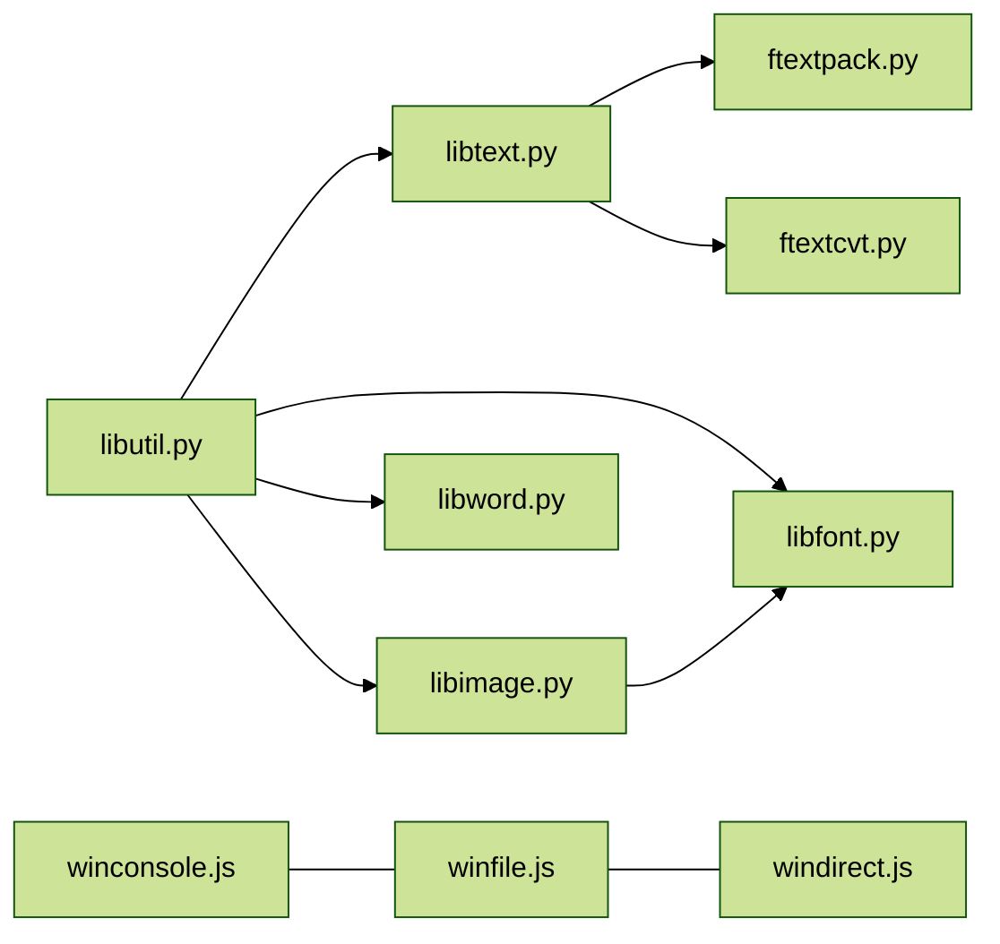

# LocalizationTool

     

🍀 General localization tools for galgame, seperated from my [WinReverse](https://github.com/YuriSizuku/toolkit-WinReverse)  
See also, [GalgameReverse](https://github.com/YuriSizuku/GalgameReverse) for specific galgames.  

## Components

### cross platfrom libraries

* `libutil.py`, basic serilization functions for ftext and tbl  
* `libtext.py`, for text exporting and importing, checking
* `libimage.py`, something about texture and picture convert  
* `libfont.py`, for extracting, building tile font, or generating font picture.
* `libword.py`, some matching and statistic method for text  
* `ftextcvt.py`, convert the `ftext` format made by `libtext.py`  
* `ftextpack.py`, method for packing `ftext` in a bin file with lower memory  

### windows platform libraries

* `winconsole.js`,  allocate a console for game  
* `winfile.js` , view information for both `CreateFile`, `ReadFile`, `WriteFile`, `fopen`,`fread`, `fwrite`  
* `winredirect.js`, redirect font, codepage, and paths in games  



## CLI Example

Install these libraries if you want to use python script.  

```shell
python -m pip install python-docx # ftextcvt
python -m pip install numpy numba pillow # libfont, libimage
python -m pip install scikit-learn # libimage, for kmeans method
```

Use these scripts to testing

```shell
sh project/pysrc_all/test_pyunit.sh
sh -c "source project/pysrc_all/test_pycli.sh && test_all"
```

**We use ">" to load or save files in zip, such as `path1/file1.zip>path2/file2`.**
**As for the `--batch` mode, replace the inpath and outpath files to the list (txtfile, or string like `dir1;path1;path2...`), usually the first path is for the base directory location**

See [test_pycli.sh](project/pysrc_all/test_pycli.sh) for details, binary build on winwdows are in [release](https://github.com/YuriSizuku/LocalizationTool/releases).  

### libtext

```shell
# insert ftext (save direct or in gz file)
python src/libtext.py insert test/sample/COM001 test/sample/COM001.txt --refer test/sample/COM001 -t test/sample/COM001.tbl -o project/pysrc_all/build/COM001_rebuild.bin --log_level info --bytes_padding "2020" --bytes_fallback "815A" --insert_shorter --insert_longer  --text_replace "季" "季季季" --text_replace "煌びやかな光" "你你你你你" 
python src/libtext.py insert test/sample/COM001 test/sample/COM001.txt --refer test/sample/COM001 -t test/sample/COM001.tbl -o project/pysrc_all/build/COM001_rebuild.bin.gz --log_level info

# extract ftext from bin file (save direct or in zip file)
python src/libtext.py extract project/pysrc_all/build/COM001_rebuild.bin -o "project/pysrc_all/build/COM001.zip>COM001/COM001_rebuild.txt" --log_level info -e sjis --has_cjk --min_len 4 --skip 0x16 --size 1024

# check ftext (direct or in zip file)
python src/libtext.py check "project/pysrc_all/build/COM001.zip>COM001/COM001_rebuild.txt" --refer project/pysrc_all/build/COM001_rebuild.bin -o "project/pysrc_all/build/COM001.zip>COM001/COM001_rebuild_check.txt" --log_level info -e sjis
```

### libfont

```shell
# font tbl operation
python src/libfont.py tbl_make cp932 --tchar_replace "亜" "亚" -o "project/pysrc_all/build/sjis.tbl"
python src/libfont.py tbl_make cp936 -o "project/pysrc_all/build/gb2312.tbl"
python src/libfont.py tbl_align "project/pysrc_all/build/sjis.tbl" -o "project/pysrc_all/build/sjis_align.tbl" --gap_static --tbl_padding "ff" "x" --gap 0 2 --gap 2 -2
python src/libfont.py tbl_merge --intersect "project/pysrc_all/build/sjis.tbl" "project/pysrc_all/build/gb2312.tbl" -o "project/pysrc_all/build/sjis_gb2312_merge.tbl" --range_reserve 0 70

# make glphy operation
python src/libfont.py font_make --format image "C:\Windows\Fonts\simhei.ttf" --tbl "test/sample/COM001.tbl" -o "project/pysrc_all/build/com001_font24.png" --tilew 24 --tileh 24
python src/libfont.py font_make --format tile "C:\Windows\Fonts\simhei.ttf" --tbl "test/sample/COM001.tbl" -o "project/pysrc_all/build/com001_font2418_8bpp.bin" --tilew 24 --tileh 18 --tilebpp 8
python src/libfont.py font_make --format tile "C:\Windows\Fonts\simhei.ttf" --tbl "test/sample/COM001.tbl" -o "project/pysrc_all/build/com001_font1614_2bpp.bin" --tilew 16 --tileh 14 --tilebpp 2 --palette "00 00 00 00 ff ff ff 60 ff ff ff a0 ff ff ff ff"

# extract glphy operation
mkdir -p "project/pysrc_all/build/com001_font24" 
mkdir -p "project/pysrc_all/build/it"
python src/libfont.py font_extract --format image "project/pysrc_all/build/com001_font24.png" -o "project/pysrc_all/build/com001_font24" --split_glphy --tilew 24 --tileh 24
python src/libfont.py font_extract --format tile "test/sample/it.bin" -o "project/pysrc_all/build/it" --split_glphy --tilew 20 --tileh 18 --tilebpp 2 --tilesize 92 --palette "ff ff ff 00 ff ff ff 3f ff ff ff 8f ff ff ff ff"
python src/libfont.py font_extract --format tile "test/sample/it.bin" -o "project/pysrc_all/build/it.jpg" --tilew 20 --tileh 18 --tilebpp 2 --tilesize 92 --palette "ff ff ff 00 ff ff ff 3f ff ff ff 8f ff ff ff ff"

```

### libimage

```shell
# decode tile to image
python src/libimage.py decode --format tile "test/sample/it.bin" -o "project/pysrc_all/build/it_decode.png" --tilew 20 --tileh 18 --tilebpp 2 --tilesize 92 --palette "ff ff ff 00 ff ff ff 3f ff ff ff 8f ff ff ff ff" 

# encode image to 1 tile
python src/libimage.py encode --format tile "project/pysrc_all/build/it_decode.png" -o "project/pysrc_all/build/it_encode1.bin" --tilebpp 2 --palette "ff ff ff 00 ff ff ff 3f ff ff ff 8f ff ff ff ff"
```

### libword

```shell
# match ftext_now
python src/libword.py match --format ftext_now test/sample/COM001.txt test/sample/COM001.txt -o project/pysrc_all/build/COM001_match.csv

# count chars in file
python src/libword.py count --format ftext_org test/sample/COM001.txt -o project/pysrc_all/build/COM001_count.csv -n 100
```

### ftextpack

```shell
# pack compact mode in zip file, and batch example
python src/ftextpack.py test/sample/COM001 test/sample/COM001.txt -o "project/pysrc_all/build/COM001.zip>COM001/COM001.fp01" -t test/sample/COM001.tbl --pack_compact
python src/ftextpack.py --batch "test/sample;COM001" "test/sample;COM001.txt" -o "project/pysrc_all/build;COM001.zip>COM001/COM001.fp02" -t test/sample/COM001.tbl --pack_compact
```

### ftextcvt

```shell
# json convert
python src/ftextcvt.py test/sample/COM001.txt -o project/pysrc_all/build/COM001.json
python src/ftextcvt.py project/pysrc_all/build/COM001.json -o project/pysrc_all/build/COM001.json.txt
```

## File Formats

### ftext (translation format text)  

The ftext files are using `utf-8 unix lf` format to store. In the ftexts,  we use `●num|addr|size● org_text` for origin text reference and `○num|addr|size○ trans_text` for translation text edit.  Do not modify the index information within `●` or `○`, and must leave a space after `●` or `○`.  

Inside the ftext, `\r` and `\n` are replaced to `[\r]` and `[\n]`. We also use `{{}}` for input some custom formats or informations to process.  

``` shell
# ftext example  
○00002|00018D|04C○ 湧き出る温泉と豊かな自然に包まれた風光明媚な地で、知る人ぞ知る観光地である。
●00002|00018D|04C● 此地温泉涌流，自然繁茂，风光明媚。可谓是内行人都知晓的胜地。

○00003|0001FD|00A○ 季節は夏。
●00003|0001FD|00A● 时值夏日。{{b'\xff'}}

○00004|000253|068○ 残月島にある唯一の街\n『@r紅霞市（こうかし）@0』では、ここ最近の不況が嘘のように盛り上がりを見せていた。
●00004|000253|068● 在残月岛{{'唯一'.encode('sjis')}}的市区“@r红霞市@0”里，近来经济之萧条每况愈下，已是人心惶惶。

○00005|000307|056○ 『@r花柳街（かりゅうがい）@0』の一郭に存在する置屋に、上流階級のお客様が現れたからだ。
●00005|000307|056● 因为有上流社会的客人来到了@r花柳街@0某郭的置屋。

○00006|000381|032○ ――今、煌びやかな光の中を一人の美しい女性が往く。
●00006|000381|032● ――此刻，正有一位美丽的女性，身披华光，款款行来。
```

### fpack (translation format text pack, ftextpack)  

Packing ftext files into a bin file, for optimizing the memory usage.  Usually use `ftextpack.py` to pack ftext files and `ftextpack.h` to search ftext in the game dynamic translation.  

### tbl (translation word encoding table)  

In the format of `tcode=tchar`, usally used for custom codepage and glphy mapping.  

```shell
8140=　
8141=、
8142=。
8143=，
8144=．
8145=・
8146=：
8147=；
8148=？
8149=！
814A=゛
814B=゜
814C=´
814D=｀
212F=¨
```

## Roadmap

* [x] seperate Localizetion Tool from ReverseTool Repo, [v0.3.5sep](https://github.com/YuriSizuku/LocalizationTool/releases/tag/v0.3.5sep)
* [x] make unit test and cli test script
* [x] write documentation about the project, such as format and cli example  
* [x] remake `libtext.py`, `libutil.py` to make more pythonic and easy to understand, [v0.4beta](https://github.com/YuriSizuku/LocalizationTool/releases/tag/v0.4beta)
* [x] remake `ftextpack.py`, `ftextcvt.py` and use unified format  
* [x] remake `libfont.py`, `libimage.py`, use numba to improve performance, [v0.4.2beta](https://github.com/YuriSizuku/LocalizationTool/releases/tag/v0.4.2beta)
* [x] finish `libfont.py` cli , [v0.4.3beta](https://github.com/YuriSizuku/LocalizationTool/releases/tag/v0.4.3beta), [0.4.5beta](https://github.com/YuriSizuku/LocalizationTool/releases/tag/v0.4.5beta)
* [x] finish `libimage.py` cli, [v0.4.4beta](https://github.com/YuriSizuku/LocalizationTool/releases/tag/v0.4.4beta)
* [x] remake `libword.py`, [v0.4.6beta](https://github.com/YuriSizuku/LocalizationTool/releases/tag/v0.4.6beta)
* [x] add collated batch files input to improve io performance [v0.5](https://github.com/YuriSizuku/LocalizationTool/releases/tag/v0.4.5beta)

## History

See [History](project/pysrc_all/History.md).  
